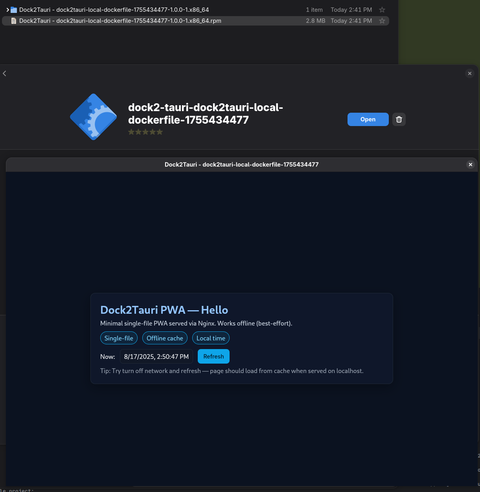
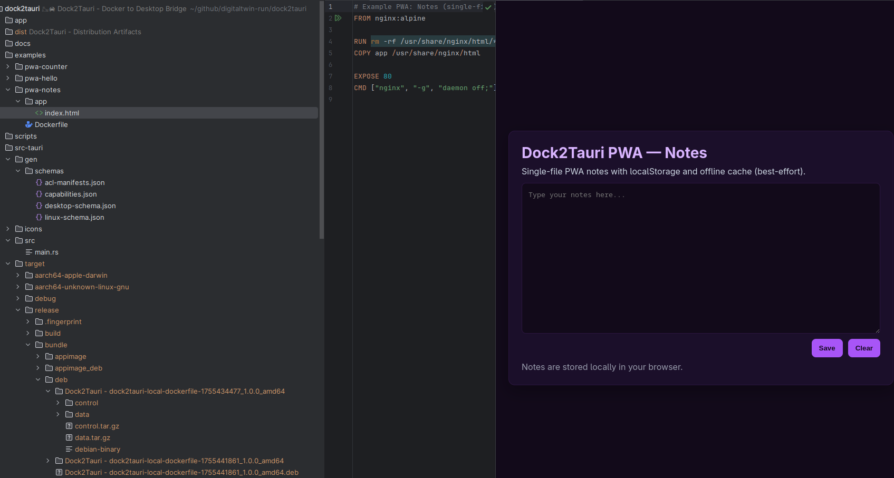
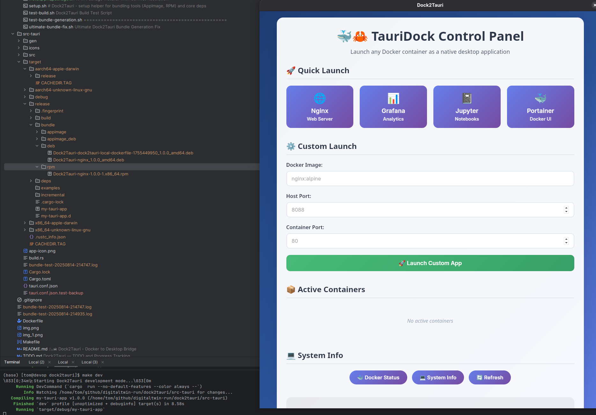

# 🐳🦀 Dock2Tauri - Docker to Desktop Bridge

Transform any Docker container into a native desktop application using Tauri.

## 🎯 Overview

Dock2Tauri is a lightweight bridge that allows you to run any Docker container as a native desktop application. It provides a modern control panel interface and multiple ways to launch containerized applications with unified CLI across Bash, Python, and Node.js launchers.

## ✨ Features

- 🚀 **One-click Docker Launch**: Run containers as desktop apps instantly
- 🎮 **Control Panel**: Modern web-based interface with preset configurations  
- 🔧 **Multi-language Support**: Bash, Python, and Node.js launchers with unified CLI
- 📦 **Dockerfile Support**: Build and serve local images from Dockerfiles
- 🏗️ **Cross-platform Builds**: Build native bundles for multiple platforms (native by default; Bash and Python CLI support optional cross-targets via `--cross`)
- 📊 **Container Management**: Start, stop, and monitor containers
- 🌐 **Auto Browser Integration**: Automatically opens container web interfaces
- ⚡ **Hot Configuration**: Dynamic port mapping and container settings
- 🔧 **Tauri v2 Compatible**: Proper schema validation and configuration
- 🧪 **Health Checks**: Configurable readiness URL and timeout
- 🧹 **Ephemeral Tauri config**: Generated on the fly and passed via `--config`; no mutations to `src-tauri/tauri.conf.json`

## 🚀 Quick Start

### Prerequisites
- Docker installed and running
- Rust toolchain with Tauri CLI (for native builds)
- Node.js (for Node.js launcher)
- Python 3.x (for Python launcher)

### Installation

**One-liner installation:**
```bash
git clone https://github.com/digitaltwin-run/dock2tauri.git && cd dock2tauri && make install-deps YES=1
```

**Quick usage:**
```bash
./scripts/dock2tauri.sh nginx:alpine 8088 80
```
OR
```bash
./scripts/dock2tauri.sh ./examples/pwa-notes/Dockerfile 8088 80 --build
```

**Full installation example:**
```bash
git clone https://github.com/digitaltwin-run/dock2tauri.git
cd dock2tauri
make install
```

```bash
Cloning into 'dock2tauri'...
remote: Enumerating objects: 355, done.
remote: Counting objects: 100% (355/355), done.
remote: Compressing objects: 100% (248/248), done.
remote: Total 355 (delta 170), reused 281 (delta 96), pack-reused 0 (from 0)
Receiving objects: 100% (355/355), 628.14 KiB | 1.86 MiB/s, done.
Resolving deltas: 100% (170/170), done.
\033[0;34m🔧 Installing Dock2Tauri...\033[0m 
\033[1;33m⚠️  Rust not found. Installing...\033[0m 
info: downloading installer
info: profile set to 'default'
info: default host triple is x86_64-unknown-linux-gnu
info: syncing channel updates for 'stable-x86_64-unknown-linux-gnu'
927.4 KiB / 927.4 KiB (100 %) 866.4 KiB/s in  1s         
info: latest update on 2025-08-07, rust version 1.89.0 (29483883e 2025-08-04)
info: downloading component 'cargo'
  9.7 MiB /   9.7 MiB (100 %) 417.0 KiB/s in 16s         
info: downloading component 'clippy'
  4.3 MiB /   4.3 MiB (100 %) 381.6 KiB/s in 13s         
info: downloading component 'rust-docs'
 20.2 MiB /  20.2 MiB (100 %) 559.4 KiB/s in 52s         
info: downloading component 'rust-std'
 27.6 MiB /  27.6 MiB (100 %) 374.4 KiB/s in  1m  8s         
info: downloading component 'rustc'
 78.1 MiB /  78.1 MiB (100 %) 289.2 KiB/s in  3m 51s             
info: downloading component 'rustfmt'
  2.2 MiB /   2.2 MiB (100 %)   1.8 MiB/s in  1s         
info: installing component 'cargo'
info: installing component 'clippy'
info: installing component 'rust-docs'
 20.2 MiB /  20.2 MiB (100 %)   4.5 MiB/s in  3s         
info: installing component 'rust-std'
 27.6 MiB /  27.6 MiB (100 %)  19.6 MiB/s in  1s         
info: installing component 'rustc'
 78.1 MiB /  78.1 MiB (100 %)  21.5 MiB/s in  3s         
info: installing component 'rustfmt'
info: default toolchain set to 'stable-x86_64-unknown-linux-gnu'

  stable-x86_64-unknown-linux-gnu installed - rustc 1.89.0 (29483883e 2025-08-04)


Rust is installed now. Great!

To get started you may need to restart your current shell.
This would reload your PATH environment variable to include
Cargo's bin directory ($HOME/.cargo/bin).

To configure your current shell, you need to source
the corresponding env file under $HOME/.cargo.

This is usually done by running one of the following (note the leading DOT):
. "$HOME/.cargo/env"            # For sh/bash/zsh/ash/dash/pdksh
source "$HOME/.cargo/env.fish"  # For fish
source $"($nu.home-path)/.cargo/env.nu"  # For nushell
\033[1;33m📦 Installing Tauri CLI...\033[0m 
/bin/sh: line 3: cargo: command not found
make: *** [Makefile:39: install] Error 127
ℹ️  Building Docker image from ./examples/pwa-notes/Dockerfile (context: ./examples/pwa-notes) as dock2tauri-local-dockerfile-1755456008 ...
[+] Building 12.4s (8/8) FINISHED                                                                                     docker:default
 => [internal] load build definition from Dockerfile                                                                            0.0s
 => => transferring dockerfile: 264B                                                                                            0.0s
 => [internal] load metadata for docker.io/library/nginx:alpine                                                                 2.3s
 => [internal] load .dockerignore                                                                                               0.0s
 => => transferring context: 2B                                                                                                 0.0s
 => [1/3] FROM docker.io/library/nginx:alpine@sha256:2459838ed006e699c252db374550c91490068bbf3b35fa8b9d29bfe0e31b8b95           9.7s
 => => resolve docker.io/library/nginx:alpine@sha256:2459838ed006e699c252db374550c91490068bbf3b35fa8b9d29bfe0e31b8b95           0.0s
 => => sha256:2459838ed006e699c252db374550c91490068bbf3b35fa8b9d29bfe0e31b8b95 10.33kB / 10.33kB                                0.0s
 => => sha256:60e48a050b6408d0c5dd59b98b6e36bf0937a0bbe99304e3e9c0e63b7563443a 2.50kB / 2.50kB                                  0.0s
 => => sha256:6bc572a340ecbc60aca0c624f76b32de0b073d5efa4fa1e0b6d9da6405976946 1.81MB / 1.81MB                                  2.0s
 => => sha256:403e3f251637881bbdc5fb06df8da55c149c00ccb0addbcb7839fa4ad60dfd04 628B / 628B                                      0.4s
 => => sha256:4a86014ec6994761b7f3118cf47e4b4fd6bac15fc6fa262c4f356386bbc0e9d9 10.78kB / 10.78kB                                0.0s
 => => sha256:9824c27679d3b27c5e1cb00a73adb6f4f8d556994111c12db3c5d61a0c843df8 3.80MB / 3.80MB                                  3.1s
 => => sha256:9adfbae99cb79774fdc14ca03a0a0154b8c199a69f69316bcfce64b07f80719f 955B / 955B                                      1.0s
 => => sha256:7a8a46741e18ed98437271669138116163f14596f411c1948fd7836e39f1afea 405B / 405B                                      1.4s
 => => sha256:c9ebe2ff2d2cd981811cefb6df49a116da6074c770c07ee86a6ae2ebe7eee926 1.21kB / 1.21kB                                  1.8s
 => => sha256:a992fbc61ecc9d8291c27f9add7b8a07d374c06a435d4734519b634762cf1c51 1.40kB / 1.40kB                                  2.2s
 => => sha256:cb1ff4086f82493a4b8b02ec71bfed092cad25bd5bf302aec78d4979895350cb 16.84MB / 16.84MB                                9.3s
 => => extracting sha256:9824c27679d3b27c5e1cb00a73adb6f4f8d556994111c12db3c5d61a0c843df8                                       0.4s
 => => extracting sha256:6bc572a340ecbc60aca0c624f76b32de0b073d5efa4fa1e0b6d9da6405976946                                       0.0s
 => => extracting sha256:403e3f251637881bbdc5fb06df8da55c149c00ccb0addbcb7839fa4ad60dfd04                                       0.0s
 => => extracting sha256:9adfbae99cb79774fdc14ca03a0a0154b8c199a69f69316bcfce64b07f80719f                                       0.0s
 => => extracting sha256:7a8a46741e18ed98437271669138116163f14596f411c1948fd7836e39f1afea                                       0.0s
 => => extracting sha256:c9ebe2ff2d2cd981811cefb6df49a116da6074c770c07ee86a6ae2ebe7eee926                                       0.0s
 => => extracting sha256:a992fbc61ecc9d8291c27f9add7b8a07d374c06a435d4734519b634762cf1c51                                       0.0s
 => => extracting sha256:cb1ff4086f82493a4b8b02ec71bfed092cad25bd5bf302aec78d4979895350cb                                       0.2s
 => [internal] load build context                                                                                               0.0s
 => => transferring context: 3.01kB                                                                                             0.0s
 => [2/3] RUN rm -rf /usr/share/nginx/html/*                                                                                    0.2s
 => [3/3] COPY app /usr/share/nginx/html                                                                                        0.0s
 => exporting to image                                                                                                          0.0s
 => => exporting layers                                                                                                         0.0s
 => => writing image sha256:373e206df2a793df17d81f3418a59a5bc5edb1c80559b5055e1eccb43f191b19                                    0.0s
 => => naming to docker.io/library/dock2tauri-local-dockerfile-1755456008                                                       0.0s
🐳🦀 Dock2Tauri - Docker to Desktop Bridge
==================================================
ℹ️  Checking dependencies...
⚠️  Rust/Cargo not found. Some features may not work.
✅ Dependencies check passed
ℹ️  Preparing Tauri configuration (ephemeral)...
⚠️  rpmbuild not found; skipping RPM bundle.
⚠️  linuxdeploy/appimagetool not found; skipping AppImage bundle.
✅ Ephemeral Tauri configuration prepared at /tmp/tauri.conf.G6Bnui.json
ℹ️  Building Tauri release bundles (multi-target export)...
ℹ️  Checking for existing dock2tauri RPM packages...
ℹ️  No existing dock2tauri packages found
ℹ️  Building bundles for target: native ...
./scripts/dock2tauri.sh: line 465: cargo: command not found
⚠️  Build failed for native target; exporting any bundles produced before failure.
⚠️  No bundles found at ./dock2tauri/src-tauri/target/release/bundle
ℹ️  Cross-target builds disabled by default. Use --cross to attempt them.
✅ All available bundles exported to: /dock2tauri/dist
ℹ️  Cleaning up...
✅ Removed ephemeral Tauri config
```
      


### Automated installer (scripts/install.sh)

If you prefer a single script to prepare your environment (system packages, Rust + Tauri CLI, and optionally Docker), use the installer:

```bash
# Install all dev dependencies required by Tauri/WebKitGTK
./scripts/install.sh

# Additionally install and enable Docker, and add current user to the docker group
./scripts/install.sh --with-docker
```

What it does:
- Detects distro (Debian/Ubuntu, Fedora/RHEL, Arch/Manjaro)
- Installs system dev packages: GTK3, WebKit2GTK, libsoup2.4, JavaScriptCoreGTK, OpenSSL, build tools, patchelf
- Installs Rust (rustup) and Tauri CLI (cargo)
- Optionally installs and enables Docker; adds your user to the docker group

After installation:
- If Docker group membership was changed, re-login or run: `newgrp docker`
- Verify tools:
  - `docker --version`
  - `cargo --version`
  - `cargo tauri --version`

Troubleshooting:
- If Tauri build complains about missing `.pc` files (e.g. `libsoup-2.4.pc`, `javascriptcoregtk-4.0.pc`), ensure the dev packages above are installed by the script.
- For non-standard installations, set `PKG_CONFIG_PATH` to include the directory with the `.pc` files, e.g.:

```bash
export PKG_CONFIG_PATH=/custom/pc/dir:$PKG_CONFIG_PATH
```

### Setup helper (scripts/setup.sh)

Install AppImage tools (linuxdeploy, appimagetool) and FUSE runtime; optionally RPM tooling. Complements `scripts/install.sh`.

```bash
# Install core deps + AppImage tools for current user (~/.local/bin)
./scripts/setup.sh

# System-wide AppImage tools (requires sudo) and RPM tooling
./scripts/setup.sh --system --rpm

# Include Docker installation via core installer
./scripts/setup.sh --with-docker

# Only AppImage tools (skip core deps)
./scripts/setup.sh --skip-core
```

Notes:
- On Debian/Ubuntu, AppImage runtime requires `libfuse2` (installed by the script).
- AppImage bundling requires both `linuxdeploy` and `appimagetool` on PATH.
- RPM bundling requires `rpmbuild` (Fedora: `rpm-build`; Debian/Ubuntu: `rpm`).

### Installing dependencies (Makefile targets)

For more granular control over system dependencies, use the new Makefile targets:

```bash
# Install system bundling dependencies only (no Rust/Tauri CLI)
make install-deps

# With AppImage tools and ARM64 cross toolchain
make install-deps APPIMAGE=1 ARM64=1 YES=1

# Dry-run (show what would be installed without changes)
make install-deps-dry-run
make install-deps-dry-run APPIMAGE=1 ARM64=1 YES=1

# Validate install scripts (syntax check + dry-run)
make test-install
```

Configuration flags:
- `APPIMAGE=1` — Install `linuxdeploy` and `appimagetool` (optional, often fails without FUSE)
- `ARM64=1` — Install ARM64 cross toolchain (`gcc-aarch64-linux-gnu`, `pkg-config-aarch64-linux-gnu`)  
- `YES=1` — Non-interactive mode (assume yes to prompts)

The install script detects your package manager (apt/dnf/yum/pacman/zypper) and installs appropriate packages for Tauri bundling on Linux:
- Base build tools and GTK3 dev libraries
- DEB packaging (`dpkg-deb` is usually available)
- RPM packaging (`rpm`/`rpmbuild`)
- Optionally: AppImage tools and ARM64 cross compiler

**ARM64 cross-compilation notes:**
After installing ARM64 toolchain, you may need ARM64 dev libraries:
```bash
# Debian/Ubuntu multiarch setup
sudo dpkg --add-architecture arm64
sudo apt update
sudo apt install -y libgtk-3-dev:arm64 libglib2.0-dev:arm64 libpango1.0-dev:arm64 libcairo2-dev:arm64 libgdk-pixbuf-2.0-dev:arm64

# Set environment for ARM64 builds
export PKG_CONFIG=aarch64-linux-gnu-pkg-config
export PKG_CONFIG_SYSROOT_DIR=/
export PKG_CONFIG_PATH=/usr/lib/aarch64-linux-gnu/pkgconfig:/usr/share/pkgconfig
```

## 📚 Documentation

Comprehensive documentation is available in the [`docs/`](docs/) directory:

- **[Architecture Overview](docs/ARCHITECTURE.md)** - System design, components, and data flow
- **[Troubleshooting Guide](docs/TROUBLESHOOTING.md)** - Common issues and solutions  
- **[Contributing Guide](docs/CONTRIBUTING.md)** - Development setup and contribution workflow
- **[Roadmap](docs/ROADMAP.md)** - Long-term vision and version planning
- **[TODO & Progress](TODO.md)** - Current tasks and priorities

## 🎉 Recent Improvements (August 2025)

Dock2Tauri has received major enhancements for stability and user experience:

### ✅ Intelligent Cross-Compilation
- **Smart target filtering** based on available toolchains
- **Auto-skip AppImage** in problematic environments (override with `DOCK2TAURI_FORCE_APPIMAGE=1`)
- **Configurable targets** via `DOCK2TAURI_CROSS_TARGETS="x,y,z"`
- **Graceful error handling** with clear troubleshooting hints

### ✅ System Dependency Management  
- **Multi-distro installer** (`scripts/install_deps.sh`) supporting apt, dnf, yum, pacman, zypper
- **Makefile integration** with configurable flags: `make install-deps APPIMAGE=1 ARM64=1 YES=1`
- **ARM64 cross-compilation** toolchain setup with multiarch support
- **Dry-run capability** for safe dependency previewing

### ✅ Enhanced Build System
- **Ephemeral Tauri config** - no more git pollution from temporary configurations
- **Dynamic bundler detection** - automatically adapts to available packaging tools
- **Automatic RPM conflict resolution** - detects and removes conflicting packages before building
- **Package naming fixes** - generated packages no longer contain spaces in filenames
- **Improved error messages** with actionable solutions
- **Better cross-platform reliability**

### ✅ Professional Documentation
- **Architecture diagrams** and component documentation
- **Comprehensive troubleshooting** for common scenarios
- **Development workflow** guides for contributors
- **Long-term roadmap** with version planning

## 🎯 Makefile Quick Commands

Dock2Tauri provides convenient Makefile targets for common operations:

### 📦 System Setup
```bash
make help                    # Show all available commands with descriptions
make status                  # Display system status (Docker, Rust, Tauri, etc.)
make install                 # Full installation (Rust, Tauri CLI, system dependencies)
make install-deps            # Install system bundling dependencies only
make install-deps-dry-run    # Preview dependency installation
make test-install            # Validate installation scripts
```

### 🚀 Quick Launch Presets
```bash
make nginx                   # Launch Nginx web server (port 8088)
make grafana                 # Launch Grafana dashboard (port 3001)  
make jupyter                 # Launch Jupyter notebook (port 8888)
make portainer               # Launch Portainer Docker UI (port 9000)

# Custom launch with parameters
make launch IMAGE=redis:alpine HOST_PORT=6379 CONTAINER_PORT=6379
```

### 🔧 Development & Testing
```bash
make dev                     # Start development mode with hot reload
make build                   # Build production bundles
make test                    # Run all launcher tests (Bash, Python, Node.js)
make test-bash               # Test Bash launcher only
make test-python             # Test Python launcher only  
make test-nodejs             # Test Node.js launcher only
```

### 🧹 Container Management
```bash
make list                    # List active dock2tauri containers
make logs                    # Show container logs
make stop-all                # Stop and remove all dock2tauri containers
make clean                   # Clean build artifacts and stop containers
```

### 📖 Help & Examples
```bash
make examples                # Show detailed usage examples
make help                    # List all available commands
```

## 📋 Usage Modes

Dock2Tauri supports three main run modes across all launchers:

### 1. Development Mode (Default)
Runs `cargo tauri dev` for development with hot reload:
```bash
./scripts/dock2tauri.sh nginx:alpine 8088 80
```

### 2. Release Build Mode
Builds distributable bundles (AppImage, .deb, .rpm, .msi, .dmg):
```bash
./scripts/dock2tauri.sh nginx:alpine 8088 80 --build
```
On Linux, bundles are generated conditionally based on available system tools:
- `.deb` requires `dpkg-deb`
- `.rpm` requires `rpmbuild`
- `.AppImage` requires `linuxdeploy` and `appimagetool`
If none are available, bundling is skipped to avoid failures.

### 3. Cross-Platform Build Mode
Builds for specific target architectures:
```bash
./scripts/dock2tauri.sh nginx:alpine 8088 80 --build --target=x86_64-pc-windows-gnu
```
Enable best-effort cross-target builds with `--cross` (Bash launcher). Cross builds require proper toolchains/sysroots and may fail without additional setup.

## 🧩 PWA Examples

This repo ships with simple single-file PWA examples for validation and demos:
- `examples/pwa-hello/`
- `examples/pwa-counter/`
- `examples/pwa-notes/`

Build and export bundles directly from a Dockerfile (served by `nginx:alpine`):

```bash
# Development mode (default) - opens Tauri app window
./scripts/dock2tauri.sh ./examples/pwa-hello/Dockerfile 8088 80
./scripts/dock2tauri.sh ./examples/pwa-counter/Dockerfile 8089 80
./scripts/dock2tauri.sh ./examples/pwa-notes/Dockerfile 8090 80

# Build production bundles (.deb, .rpm, etc.)
./scripts/dock2tauri.sh ./examples/pwa-hello/Dockerfile 8088 80 --build
./scripts/dock2tauri.sh ./examples/pwa-notes/Dockerfile 8088 80 --build

# Build with cross-compilation (requires toolchains)
./scripts/dock2tauri.sh ./examples/pwa-hello/Dockerfile 8088 80 --build --cross
./scripts/dock2tauri.sh ./examples/pwa-notes/Dockerfile 8088 80 --build --cross
```

**Note:** 
- If the first argument is a Dockerfile and `--build` is NOT provided, the Bash launcher defaults to building and exporting bundles into `dist/`
- Cross-compilation (`--cross`) automatically skips problematic targets and AppImage in cross-build mode
- Generated packages no longer contain spaces in filenames: `Dock2Tauri-dock2tauri-local-dockerfile-...`

## 🔧 Unified CLI Interface

All three launchers (Bash, Python, Node.js) now support the same flags and functionality:

### Common Flags
- `--build` / `-b`: Build Tauri release bundles instead of dev mode
- `--target=<triple>`: Specify target architecture for cross-compilation
- `--cross` (Bash only): Attempt best-effort cross-target builds (requires toolchains; may fail)
- `--help` / `-h`: Show help information
 - `--health-url=<url>`: Override readiness URL (default: `http://localhost:HOST_PORT`)
 - `--timeout=<seconds>`: Readiness timeout (default: `30`)

### Dockerfile Support
All launchers can build and serve local Docker images from Dockerfiles:
```bash
# If first argument is a Dockerfile path, builds local image
./scripts/dock2tauri.sh ./Dockerfile 8088 80
```

The `./app` folder content will be served by the built container.
For the Bash launcher, if a Dockerfile path is provided and `--build` is not specified, it will default to build and export bundles to `dist/`.
For the Python CLI (`taurido`), the same default applies: Dockerfile input without `--build` triggers build + export.

## 🛠️ Launcher Scripts

### Method 1: Bash Script (Recommended)
```bash
# Basic usage
./scripts/dock2tauri.sh <docker-image|Dockerfile> <host-port> <container-port> [--build] [--target=<triple>] [--health-url=<url>] [--timeout=<seconds>]

# Examples
./scripts/dock2tauri.sh nginx:alpine 8088 80
./scripts/dock2tauri.sh ./Dockerfile 8088 80
./scripts/dock2tauri.sh grafana/grafana 3001 3000 --build
./scripts/dock2tauri.sh jupyter/scipy-notebook 8888 8888 --target=x86_64-pc-windows-gnu
./scripts/dock2tauri.sh grafana/grafana 3001 3000 --health-url=http://localhost:3001/login --timeout=60
./scripts/dock2tauri.sh ./examples/pwa-hello/Dockerfile 8088 80 --build --cross
./scripts/dock2tauri.sh ./examples/pwa-notes/Dockerfile 8088 80 --build --cross
```

### Method 2: Python CLI (taurido)


The standalone Python package `taurido` provides a CLI with the same behavior as the Bash launcher, including dynamic Linux bundler detection and defaults for Dockerfile input.

```bash
# From repo root (contains src-tauri/)
taurido ./examples/pwa-hello/Dockerfile 8088 80

# From another directory, point to project root explicitly
taurido --project-root ./dock2tauri ./examples/pwa-hello/Dockerfile 8088 80

# Or via environment variable
TAURIDO_PROJECT_ROOT=./dock2tauri taurido ./examples/pwa-hello/Dockerfile 8088 80
```

Notes:
- If the first argument is a Dockerfile and `--build` is NOT provided, `taurido` defaults to building and exporting bundles into `dist/`.
- `--cross` is supported as best-effort when proper toolchains are installed.

### Method 3: Python Script
```bash
# Basic usage
python3 scripts/dock2tauri.py --image <image> --host-port <port> --container-port <port> [--build|-b] [--target <triple>] [--health-url <url>] [--timeout <seconds>]

# Examples
python3 scripts/dock2tauri.py --image nginx:alpine --host-port 8088 --container-port 80
python3 scripts/dock2tauri.py --image grafana/grafana --host-port 3001 --container-port 3000 --build
python3 scripts/dock2tauri.py --image jupyter/scipy-notebook --host-port 8888 --container-port 8888 --target x86_64-pc-windows-gnu
python3 scripts/dock2tauri.py -i grafana/grafana -p 3001 -c 3000 --health-url http://localhost:3001/login --timeout 60
```



### Method 4: Node.js Script
```bash
# Basic usage
node scripts/dock2tauri.js [image|Dockerfile] [host-port] [container-port] [--build|-b] [--target=<triple>] [--health-url=<url>] [--timeout=<seconds>]

# Examples
node scripts/dock2tauri.js nginx:alpine 8088 80
node scripts/dock2tauri.js grafana/grafana 3001 3000 --build
node scripts/dock2tauri.js jupyter/scipy-notebook 8888 8888 --target=x86_64-pc-windows-gnu
node scripts/dock2tauri.js grafana/grafana 3001 3000 --health-url=http://localhost:3001/login --timeout=60
```

### Method 5: Makefile Commands
```bash
# Launch Nginx as desktop app
make nginx

# Launch Grafana dashboard  
make grafana

# Launch custom container
make launch IMAGE=my-app:latest HOST_PORT=8088 CONTAINER_PORT=80
```

## 📦 Building Native Bundles

### Building for Current Platform
```bash
# Any launcher with --build flag
./scripts/dock2tauri.sh nginx:alpine 8088 80 --build
python3 scripts/dock2tauri.py --image nginx:alpine --host-port 8088 --container-port 80 --build
node scripts/dock2tauri.js nginx:alpine 8088 80 --build
```

### Cross-Platform Building
```bash
# Build for Windows from Linux/macOS
./scripts/dock2tauri.sh nginx:alpine 8088 80 --build --target=x86_64-pc-windows-gnu

# Build for Linux ARM64
./scripts/dock2tauri.sh nginx:alpine 8088 80 --build --target=aarch64-unknown-linux-gnu
```

### Build Artifacts Location
Built bundles are saved to:
- `src-tauri/target/release/bundle/` (native platform builds)
- `src-tauri/target/<target-triple>/release/bundle/` (cross-platform builds)

Additionally, the Bash and Python CLI export bundles to a friendly path under `dist/<platform>/` (e.g., `dist/linux-x64/`).

Supported bundle formats:
- **Linux**: AppImage, .deb, .rpm
- **Windows**: .msi, .nsis (installer)
- **macOS**: .dmg, .app bundle

### Android (best-effort)

If Android SDK is detected (`ANDROID_SDK_ROOT` or `ANDROID_HOME`), the Bash and Python CLI attempt to build an Android APK automatically during `--build`.

Output: `dist/android-apk/`

Requirements: Android SDK/NDK, Java (JDK), Gradle, and Tauri Mobile tooling.

### Manual Packaging (Fedora Workaround)
On some Fedora systems, the Tauri CLI may not generate bundles despite successful builds. Use the manual packaging script as a workaround:
```bash
./scripts/build-bundles.sh
```

This script provides automatic fallback to manual AppImage and .deb creation.

## ⚠️ Known Issues & Warnings

### WebKitGTK Warning (Harmless)
You may see this warning during development - it's harmless and can be ignored:
```
Gdk-Message: 15:34:22.123: Unable to load webkit2gtk-web-extension: ...
```

### Fedora Bundle Generation
On some Fedora systems, the Tauri CLI may not generate bundles despite successful builds. Use the manual packaging script as a workaround.

## 🔧 Technical Details

### Tauri Configuration
All launchers generate valid Tauri v2 configuration with:
- Proper JSON schema validation
- Dynamic port and identifier configuration  
- Bundle targets (Bash): chosen dynamically on Linux (DEB/RPM/AppImage), skipped if required system tools are missing
- Bundle targets (Python CLI - `taurido`): chosen dynamically on Linux (DEB/RPM/AppImage) with FUSE-less AppImage support via `APPIMAGE_EXTRACT_AND_RUN=1`; AppImage is skipped if tools are not runnable
- Bundle targets (Node): fixed set; ensure required tools are installed to avoid failures
- Security policies and window settings
- Icon handling with fallback generation
 - Ephemeral config path passed via `cargo tauri --config` without modifying `src-tauri/tauri.conf.json`

### Build System
- Uses `build.rs` to generate valid PNG icons automatically
- Disables default icon loading during development
- Supports both static and dynamic Tauri configurations
- Cross-platform Rust toolchain integration
